# percona_client_install_ansible
Ansible code for installing percona client in the enterprise

I also made a video on my youtube channel pointing out the different advanced features this playbook uses. 
